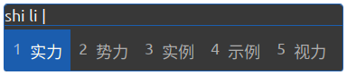
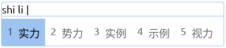
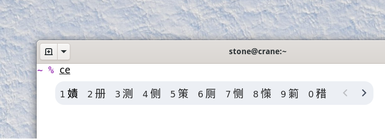
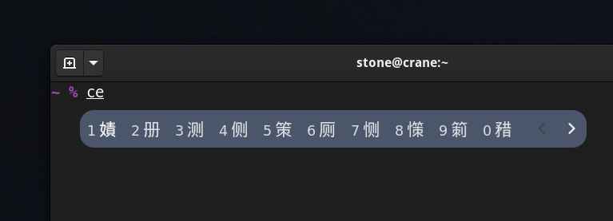

# IBus Theme Hub

[中文 Chinese](README_CN.md)

This is the hub for IBus theme that can be used by [Customize IBus GNOME Shell Extension](https://github.com/openSUSE/Customize-IBus).

[][ego]

## [Microsoft IME Theme](仿微软Microsoft)
- [Blue Dark](仿微软Microsoft/Blue-Dark-科技蓝-深色-1A5FB4.css) #1A5FB4

- [Blue Light](仿微软Microsoft/Blue-Light-科技蓝-浅色-99C1F1.css) #99C1F1

- [Green Dark](仿微软Microsoft/Green-Dark-薄荷绿-深色-2CA52A.css) #2CA52A
- [Green Light](仿微软Microsoft/Green-Light-薄荷绿-浅色-8FF0A4.css) #8FF0A4
- [Grey Dark](仿微软Microsoft/Grey-Dark-混沌灰-深色-59575D.css) #59575D
- [Grey Light](仿微软Microsoft/Grey-Light-混沌灰-浅色-C0BFBC.css) #C0BFBC
- [Orange Dark](仿微软Microsoft/Orange-Dark-热带橙-深色-C64600.css) #C64600
- [Orange Light](仿微软Microsoft/Orange-Light-热带橙-浅色-FFBE6F.css) #FFBE6F
- [Purple Dark](仿微软Microsoft/Purple-Dark-木槿紫-深色-613583.css) #613583
- [Purple Light](仿微软Microsoft/Purple-Light-木槿紫-浅色-DC8ADD.css) #DC8ADD
- [Red Dark](仿微软Microsoft/Red-Dark-玫瑰红-深色-D13163.css) #D13163
- [Red Light](仿微软Microsoft/Red-Light-玫瑰红-浅色-FC8E9F.css) #FC8E9F
- [Turquoise Dark](仿微软Microsoft/Turquoise-Dark-水鸭青-深色-128FA3.css) #128FA3
- [Turquoise Light](仿微软Microsoft/Turquoise-Light-水鸭青-浅色-ABECED.css) #ABECED

## [Nord Theme](nord-theme)
- [Snow Storm Light](nord-theme/snow-storm-light.css) #D8DEE9

- [Polar Night Dark](nord-theme/polar-night-dark.css) #2E3440

## [... Waiting for Your Contribution](https://github.com/openSUSE/IBus-Theme-Hub/issues/1)

## You can also use [IBus Theme Tools](https://github.com/openSUSE/IBus-Theme-Tools) to extract IBus theme from GNOME Shell Theme.

## Acknowledgements

_This project was part of the achievement of [@HollowMan6](https://github.com/HollowMan6) partipating the [Google Summer of Code 2021](https://summerofcode.withgoogle.com/archive/2021/projects/6295506795364352/) at [OpenSUSE](https://github.com/openSUSE/mentoring/issues/158)._

[ego]: https://extensions.gnome.org/extension/4112/IBus-Theme-Hub/
